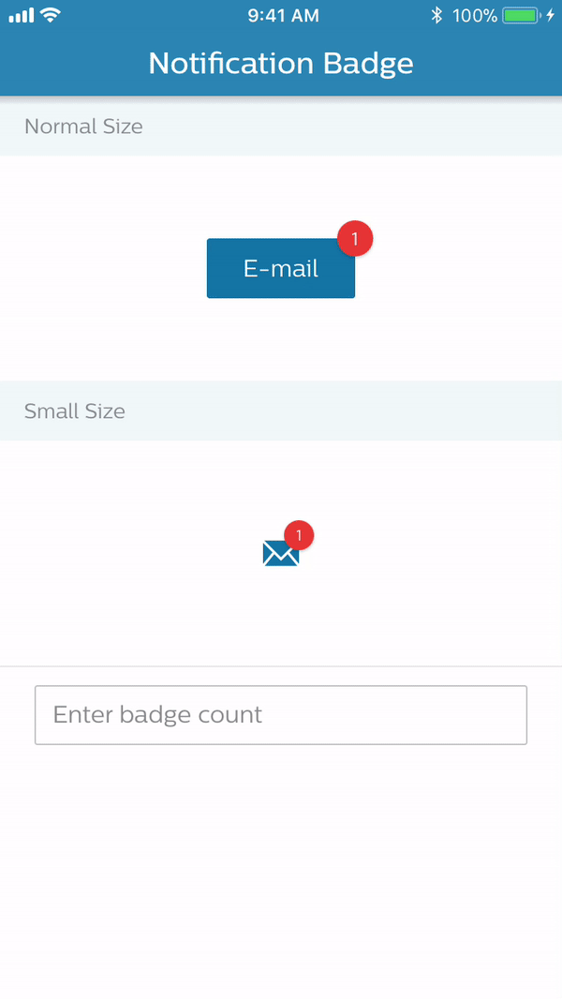

# SwiftNotificationBadge
A light weight Notification badge UI component written in Swift.
-------------------

SwiftNotificationBadge is a framework for NotificationBadge UI component, which is subclass of UIView.
NotificationBadge supports two different size, default(24*24) and small(20*20). It's also supports the `Drop Shadow` which looks like below. i.e.



## Usage
- **SwiftNotificationBadge** framework have **NotificationBadge** as core class, which responsible for displaying the badge value & Update the badge value anytime.

### TODO
- Example app with SwiftNotificationBadge.
- Unit Test-Cases for SwiftNotificationBadge framework.
-------------------

# Installation

## CocoaPods
[CocoaPods](http://cocoapods.org) is a dependency manager for CocoaProjects.
To integrate RxBluetoothKit into your Xcode project using CocoaPods specify it in your `Podfile`:
```ruby
source 'https://github.com/crazymanish/CocoaPodsSpecs.git'  #Add this source line, this library still under development.

pod 'SwiftNotificationBadge'  #Add CocoaPods dependency for SwiftNotificationBadge
```

## Integration
- In InterfaceBuilder it is possible to create a UIView and give it the class as NotificationBadge,
the styling will be done immediately.
- Use "badgeCount" API to update the notification badge count any-time.

# Requirements
- iOS 10.0+
- Xcode 10.0+

# Swift versions
* Current version supports Swift 4.2

# LICENSE
* MIT
